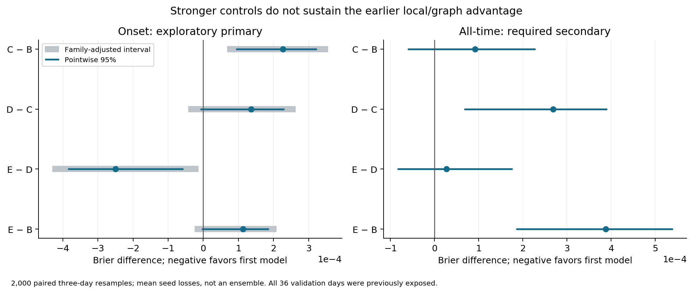
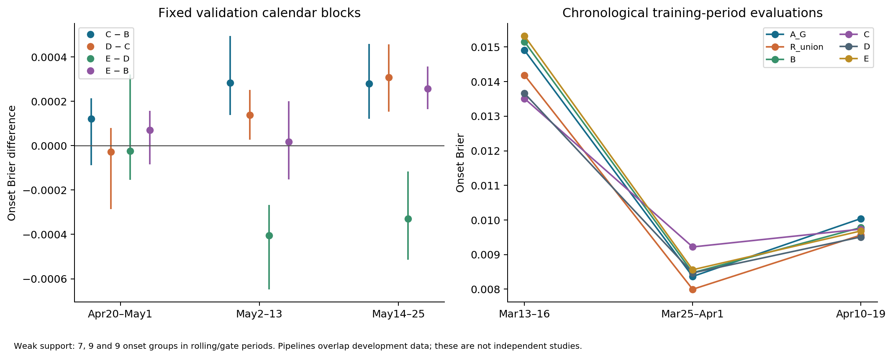
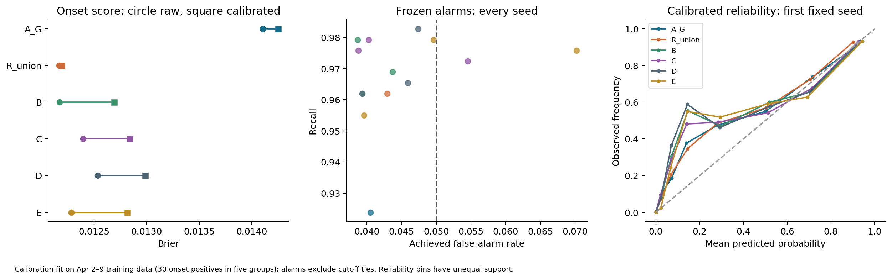
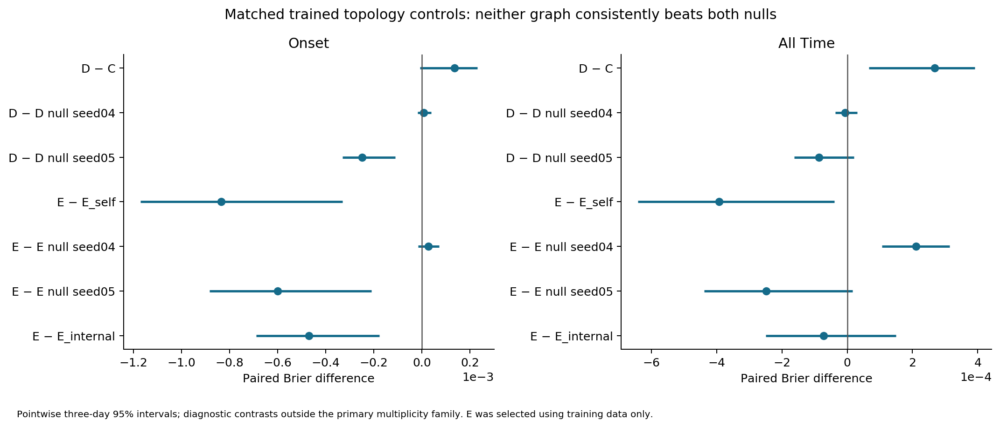
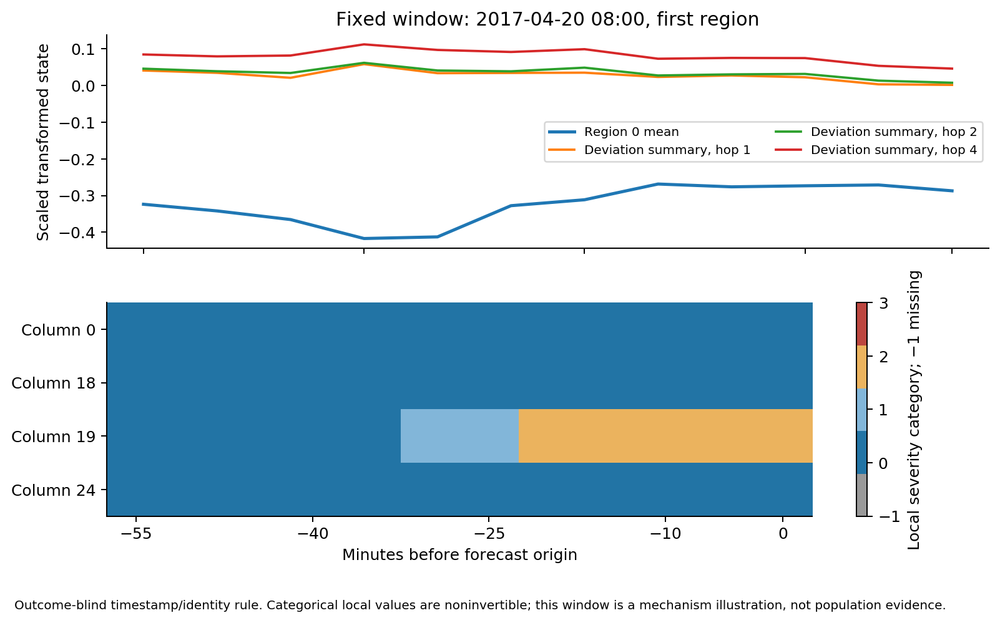

# Exploratory onset and graph study — 23 September 2026

The earlier local/graph onset advantage **did not survive this registered continuation**. On identical validation origins, aggregate correction B and the refreshed aggregate baseline R_union score essentially equally on onset Brier. Local C is worse than B; distance graph D is worse in point estimate than C. Training-selected expanded representation E improves on D, but fails to improve on B and raises false alarms. Neither D nor E consistently beats both matched trained rewired graphs. These findings do not establish zero information value in local traffic measurements.

**Recommendation:** the next authorized experiment should be a small, frozen chronological comparison of aggregate refitting R_union versus aggregate correction B, with separately supported alarm calibration. Do not advance a graph-information or acquisition claim from this evidence. No next experiment is executed or scheduled here. The original test measurements, predictions and event-dependent summaries remain untouched.

## Execution and historical evidence

Started on clean `main` at `1eafe14dc1ac6cd65a1647f949c9422e58a9db22`. Origin `https://www.github.com/mantzaris/EAI-BDCC2026` was verified, fetched and already current; there were no applicable AGENTS.md files or unrelated changes. All prior reports/results/source remain intact. Only README's current-status narrative is updated. The [starting inventory](../manifests/onset_graph/starting_state.json) and [preservation checks](../manifests/onset_graph/delivery_checks.json) document this.

The [protocol](ONSET_GRAPH_PROTOCOL.md) and [machine configuration](../configs/onset_graph_study.json) were committed **before fitting**. All new fitting, graph estimation, transformations, labels, synthetic checks, prediction, metrics and resampling ran on CUDA. CPU work was limited to orchestration, metadata, parsing/serialization, hashes, syntax checks and rendering. There was no CPU experiment, new dataset, simulator campaign, enclosure refinement, paper draft or full study.

| Experimental source | Work actually executed |
|---|---|
| `48e31b66745d577105c5aa8f2b8b2e6690fafd0b` | Initial GPU scientific checks, exact prior-checkpoint replay, all three chronological pipelines, all baseline/correction fits, graph estimation, main topology-null fits and training-only extension decision |
| `70e03d050022e294340712071c0d8a261fb04438` | Frozen outer evaluation, secondary calibrated contrasts, noninvertible illustrative export, all new checkpoint replays |
| `541723f5c858cb852742b7080e59e0a391b37779` | Supplementary GPU contrasts, alignment/clipping summaries and transfer-inclusive cost checks; no fitting or selection |

The latter two sources do not change fitted models, graphs, preprocessing or training. Later changes are reports, metadata validation and rendering. Each job records its source, configuration hash, environment and completion. The final delivery commit is reported separately rather than inserted into its own content.

The prior A_T and all nine B/C/D checkpoints replayed **exactly**, including all saved scores. On 10,309 all-time origins their previous mean Briers remain .02051931/.01835239/.01825131/.01818375. On 8,981 onset origins, including 289 positives, they remain .01497963/.01271936/.01233733/.01224642. Prior onset C−B/D−B/D−C relative improvements were 3.0036%/3.7183%/.7369%, with favorable pointwise three-day intervals. Corresponding all-time incremental intervals crossed zero. Prior onset recall/FPR remains A_T 93.77%/5.58%, B 97.46%/7.85%, C 96.77%/5.40%, D 96.66%/5.15%. [Exact replay records](../results/onset_graph/study01/main/prior_replay.json) preserve individual seeds.

**Onset was a secondary endpoint of that prior pilot.** Its favorable secondary finding motivated the prospectively registered exploratory primary endpoint here. All 36 validation days were already exposed. Reusing them with a new protocol does not create independent confirmation. Earlier Stage 1/2 results—original 128-panel aggregate .02646, direct local .03061/.03046, repaired simulator .03360, unresolved slower enclosures—retain their original population and scope. The original sklearn fitted trees remain missing; 128 saved probabilities do not recover that predictor. Its score is not directly compared with complete-validation scores below.

## Target, information and chronological comparability

PEMS-BAY has 52,116 five-minute records over 325 ordered sensors, January–June 2017, recorded speed in mph, with naive timestamps and no timezone metadata. The target remains at least **48 sensors at/below half their original training reference free speed for three consecutive frames** within the six-frame future. History is 12 frames. It is a sustained recorded-speed event, not an observed road incident or causal cascade. Onset eligibility excludes currently or possibly active events using the same three-frame current rule.

Keep the original 108 training days (Jan 1–Apr 19, excluding incomplete Mar 12), 36 validation days (Apr 20–May 25), original test boundary, complete contained windows and two-sided 90-minute embargo. Nonfinite/nonpositive measurements are unknown. Lower/upper future event bounds and at least 95% coverage determine eligibility; future labels are never imputed. Historical target constants were fitted on the full original training period; they are held fixed to preserve the task, **not claimed historically available at the earlier inner fit cutoffs**. New predictor transforms and estimated graphs use only their own earlier permitted measurements.

The main complete validation workload has 10,315 timestamp-eligible origins, **10,309 observed eligible**, six exclusions for future coverage, no ambiguous bounded labels, 1,478 all-time positives (14.33699%). Onset has **8,981 origins, 289 positives, prevalence 3.21790%, 8,692 negatives**, 47 separated positive groups on 26 event days. All arms have identical origin IDs, labels, eligibility, weights, horizons and onset conventions. Predictions, bounds, coverage and active masks are saved together in compressed CSVs. No model uses validation labels for preprocessing, fitting, graph estimation, alpha, calibration or alarm selection.

The aggregate vector contains 1,158 features: 12 histories of regional means and valid counts; six calendar terms; and regional variance, minimum, maximum and severe-fraction histories. These already require **reading all sensors**. C/D/E/F add full local ordered histories, deviations, changes and masks. M uses only existing aggregate information plus fixed graph metadata. S adds graph-propagated deviation summaries after all-sensor ingestion. No deployment-time sensor selection inspects hidden values.

The common **A_G** anchor is a separately named CUDA quantile-boosting baseline. It is not A_T or recovered sklearn inference. It uses the same aggregate feature categories, 100 trees, 15 leaves, 64 bins, minimum leaf20 and learning rate .1. L2 {3,10} is selected within the anchor period using its last eight days, with preprocessing fitted before that inner cut. L2=3 wins in all pipelines. The selected specification is refitted on all anchor days. Main A_G uses **5,173 labels, 558 positives, stride3**, versus historical A_T's 1,294 labels, 131 positives at stride12. Its learned feature free speeds, bins and weights are recoverable.

Main corrections train on **1,897 later stride3 labels, 240 positives**. No such outcome fitted A_G. **R_union** uses exactly their union with the anchor set: **7,070 labels, 798 positives**, same input transform, tree specification and stride3. Thus R_union addresses both later label availability and denser sampling. Correction transforms use correction-period inputs only; A_G is frozen. R_union is a control, never an in-sample residual-training anchor. There is no baseline-distribution mismatch between correction fitting and main evaluation. R_union reuses the anchor-selected L2 rather than receiving a larger tuning allowance.

A_mono is a simple monotone recalibration of A_G fitted on correction-period onsets, which are out of sample for A_G. B is the original aggregate residual family; K gives aggregate-only prediction approximately the same capacity as local models. The strongest aggregate comparator **G=B**, and expanded representation **X=E**, were selected by seed-mean onset loss on the shrinkage block, before outer evaluation. R_union remains a mandatory control even though it was not G. Differences from the previous pilot include training density, baseline L2 selection, new fixed seeds and separate calibration; this is not a one-factor causal explanation of the earlier result's reversal.

| Main role, 2017 | Complete days | All eligible origins / positives | Onset origins / positives | Onset groups / event days |
|---|---:|---:|---:|---:|
| Anchor Jan1–Feb23 | 54 | 15,517 timestamp origins; strided fit above | Not used as evaluation | No independence claim from strided labels |
| Correction Feb24–Mar16, excluding Mar12 | 20 | 5,690 / 723 | 5,045 / 156 | 26 / 15 |
| Early stop/settings Mar17–24 | 8 | 2,251 / 228 | 2,047 / 48 | 8 / 6 |
| Shrinkage/arm selection Mar25–Apr1 | 8 | 2,251 / 212 | 2,069 / 57 | 9 / 5 |
| Calibration/alarms Apr2–9 | 8 | 2,251 / 97 | 2,169 / 30 | 5 / 4 |
| Training-only gate Apr10–19 | 10 | 2,827 / 205 | 2,649 / 54 | 9 / 7 |

Every role has complete windows and embargoes. [Exact main splits](../results/onset_graph/study01/main/split_manifest.json), [rolling1](../results/onset_graph/study01/rolling1/split_manifest.json) and [rolling2](../results/onset_graph/study01/rolling2/split_manifest.json) include ordered days, origin IDs, permitted HDF slices and exposure status. Sparse development groups make both tuning and calibration unstable. Groups separated by 30 minutes are forecast clusters, not proven independent incidents.

## Six representations and controls

All corrections use `rθ=0.5 tanh(hθ)` and `pα=clip(A_G+αrθ,0,1)`. The objective is **unweighted all-time Brier plus λ mean(rθ²)**, with AdamW decay .0001. A zero output head and randomly initialized upstream network give exact baseline recovery with a nonzero learning gradient. Neither construction promises generalization. Onset loss selects early stopping, λ and global per-seed α∈{0,.25,.5,1}; no event weighting or alternative probability target is used.

Each B/K/C/D/M/S/E/F family has exactly λ∈{.01,.1}, tuning seed20260930, followed by all three seeds20261001/02/03. Width16 shared temporal MLP, width32 aggregate/head, batch256, learning rate .001, at most60 epochs, patience8. K's aggregate width42 controls capacity. All 154 correction attempts across folds/nulls completed and are retained, including unfavorable settings. Twelve tree fits include two tuning fits, final anchor and R_union in each pipeline. No best seed or probability ensemble is reported.

| Arm | Mechanism | Trainable correction parameters | Main λ; α for seeds 01/02/03 |
|---|---|---:|---|
| B | Aggregate residual | 38,209 | .01; .5/1/1 |
| K | Aggregate capacity control | 50,129 | .01; .5/1/1 |
| C | Shared ordered-history MLP, self messages, fixed regional identity | 49,553 | .01; .25/1/1 |
| D | C with original normalized neighbor message | 49,553 | .01; .5/1/1 |
| M | Aggregate regional histories and Q=RWL regional messages; no local inputs | 49,937 | .01; 1/1/1 |
| S | Coarse/deviation graph summaries at hops1/2/4 | 50,321 | .1; 1/1/1 |
| E | Self, within-region and cross-region messages | 49,809 | .01; 1/1/1 |
| F | D with training-estimated residual association graph | 49,553 | .01; .5/1/1 |

E_internal keeps E's capacity/total-neighbor denominator but zeroes the cross message; it uses E's selected λ and three seeds. This is a matched mechanism control, not a certificate. M/S retain region-indexed pooling and approximately matched capacity; their input construction differs intentionally. All attempt histories, epochs, costs and checkpoint hashes are in `results/onset_graph/study01/<fold>/*_attempts.json`.

The original W is the verified row-normalized distance-similarity graph, self loops removed with 12 isolated-row identity fallbacks. Row i aggregates j. It has 2,369 nonself edges, 1,130 crossing regions. It is not verified directed road flow. F removes 22 calendar/regional common regressors from **15,534 complete anchor measurement vectors**, using GPU pseudoinverse rtol1e-8, then selects absolute residual Pearson associations at matched per-row nonself outdegree. F also has 2,369 edges, 1,061 crossing regions; 590 overlap original edges and 1,015 selected correlations are negative before taking absolute value. Outdegree/density match D; indegree and weight distributions need not. Statistical association is not causality. [Graph manifests](../results/onset_graph/study01/main/graphs.json) record cutoffs, normalization and residual-regression diagnostics.

## Comparable outer results

Means average seed-specific losses, **not losses of averaged probabilities**. Single baseline arms have one deterministic fit. All-time and onset denominators are those above. Calibration is fitted later on out-of-sample training data and never replaces raw primary scores.

| Arm | Raw onset Brier | Calibrated onset | Raw all-time Brier | Calibrated all-time |
|---|---:|---:|---:|---:|
| A_G | .01410650 | .01424964 | .01862313 | .01852038 |
| R_union | **.01216714** | **.01219021** | **.01605473** | **.01620664** |
| A_mono | .01360109 | .01436712 | .01792570 | .01872448 |
| B = G | **.01216962** | .01268951 | .01704202 | .01870318 |
| K | .01316366 | .01350643 | .01784279 | .01932948 |
| C | .01239595 | .01283874 | .01713412 | .01836274 |
| D | .01253247 | .01298439 | .01740284 | .01907269 |
| M | .01317286 | .01359874 | .01781364 | .01959079 |
| S | .01308379 | .01348487 | .01766891 | .01931828 |
| E = X | .01228246 | .01281446 | .01742977 | .01930385 |
| F | **.01214400** | .01259882 | .01700232 | .01835243 |
| E_internal | .01275329 | .01316739 | .01750171 | .01902130 |
| D rewire seed04 | .01252459 | .01299675 | .01740921 | .01914713 |
| D rewire seed05 | .01278144 | .01319925 | .01749027 | .01905586 |
| E self | .01311685 | .01351191 | .01782217 | .01943867 |
| E rewire seed04 | .01225550 | .01274551 | .01721933 | .01891332 |
| E rewire seed05 | .01288350 | .01327121 | .01767856 | .01921970 |

F's lowest raw onset point estimate does **not** replace training-selected E. Its gain over B is only .0000256195, or .2105%, pointwise three-day interval [−.000124756,+.000041182] for F−B. It misses both registered local materiality scales (1% and .0001), has mixed paired-seed differences, and did not receive F-specific trained topology nulls because E was selected. F−D is −.000388466, unadjusted interval [−.000546544,−.000168045]; this diagnoses the chosen distance representation, not a verified topology contribution beyond aggregate information.

B−R_union onset is +.0000024819, interval [−.000772988,+.000751233]. R_union also has the best all-time score. Much of the apparent value of a correction over an older frozen predictor can be obtained by a straightforward aggregate refit with the same later labels. This is a competitive-control finding, not proof that every residual architecture merely recalibrates.

### Declared primary family and uncertainty

Use 2,000 paired three-day resamples, preserving every model's origin pairing and all seed losses. Calendar gaps are not joined. One-day resampling is the stated sensitivity analysis. The four declared raw onset contrasts also use Bonferroni percentile 98.75% marginal intervals, an approximate familywise95% assessment. These intervals condition on the fitted training data/settings and the mean of these three seeds; they do not integrate over future training seeds, development-selection uncertainty or new periods. Small block counts and previously exposed validation remain limitations.

| Raw onset contrast | Difference | Relative reduction (negative = worse) | Pointwise three-day95% | Family-four adjusted interval |
|---|---:|---:|---|---|
| C−B | +.000226328 | −1.8598% | [+.000093015,+.000323713] | [+.000067843,+.000355090] |
| D−C | +.000136519 | −1.1013% | [−.000008329,+.000230838] | [−.000042822,+.000262562] |
| E−D | −.000250002 | +1.9948% | [−.000385595,−.000056794] | [−.000429482,−.000013598] |
| E−B | +.000112844 | −.9273% | [−.000004452,+.000186068] | [−.000024795,+.000208179] |

C−B and E−D retain their directions in the adjusted one-day sensitivity. D−C's one-day pointwise interval excludes zero adversely but its family-adjusted interval crosses; the main three-day result is uncertain. E−B's one-day pointwise adverse interval also loses exclusion after adjustment. No favorable local-versus-aggregate result survives this declared family.

All-time C−B is +.000092099 [−.000061423,+.000228612]; D−C +.000268725 [+.000066958,+.000391384]; E−D +.000026925 [−.000084516,+.000176467]; E−B +.000387748 [+.000184746,+.000539988]. These are secondary pointwise intervals. After monotone calibration, onset C−B remains adverse at +.000149234 [+.000044360,+.000221553], and E−B +.000124954 [+.000032953,+.000186504]. Calibrated E−D's three-day interval crosses zero. Calibration does not establish a local advantage.

| Arm | Raw onset seed01 | Seed02 | Seed03 | Seed standard deviation |
|---|---:|---:|---:|---:|
| B | .01248703 | .01215427 | .01186756 | .00025313 |
| K | .01243178 | .01366129 | .01339790 | .00052857 |
| C | .01322820 | .01169575 | .01226390 | .00063255 |
| D | .01253012 | .01291799 | .01214928 | .00031383 |
| M | .01393980 | .01295133 | .01262745 | .00055819 |
| S | .01394899 | .01297082 | .01233157 | .00066512 |
| E | .01175377 | .01302411 | .01206951 | .00054003 |
| F | .01250371 | .01158067 | .01234762 | .00040340 |

Standard deviations use these three seed scores with denominator three, not a confidence interval. C−B, D−C, E−D and F−B directions vary across seeds. Selection/shrinkage and optimization can affect trained-graph comparisons even when inference is weakly sensitive to graph perturbation. A three-seed average must not be described as three independent replications of the traffic event process.

## Chronological robustness

Both rolling pipelines and the main gate were executed, irrespective of unfavorable outcomes. Their earlier role cutoffs were registered before fitting; they overlap other pipelines' development periods and are not independent studies. Rolling1 selects G=B/X=E; rolling2 selects G=R_union/X=E; main selects G=B/X=E.

| Raw onset Brier | Mar13–16, 42 positives / 7 groups / 4 event days | Mar25–Apr1, 57 / 9 / 5 | Apr10–19 gate, 54 / 9 / 7 |
|---|---:|---:|---:|
| A_G | .01490125 | .00836791 | .01004037 |
| R_union | .01418466 | .00799711 | .00956408 |
| B | .01514840 | .00847662 | .00978139 |
| C | .01350933 | .00922113 | .00973640 |
| D | .01365864 | .00847055 | .00950922 |
| M | .01516666 | .00898390 | .00950729 |
| S | .01361891 | .00849357 | .00960870 |
| E | .01531651 | .00856213 | .00968247 |
| F | .01558389 | .00840312 | .00963565 |

Onset denominators are 962/2,069/2,649 respectively. C helps in rolling1 but loses in rolling2. E is unfavorable relative to D in both earlier rolling evaluations. The two small shrinkage blocks supporting those selections had just four and two onset groups. Calibration worsens every listed rolling1/rolling2 onset score but improves main-gate scores; complete raw/calibrated all-time and onset results for **every** family are in [metrics.csv](../results/onset_graph/study01/metrics.csv) and each fold's gate JSONs. No weak fold was dropped.

| Fixed validation block | Onset n / positives / groups / event days | B | C | D | E | F |
|---|---|---:|---:|---:|---:|---:|
| Apr20–May1 | 3,083 / 78 / 13 / 8 | .00931518 | .00943683 | .00940899 | .00938438 | .00924294 |
| May2–13 | 2,968 / 105 / 16 / 9 | .01565419 | .01593778 | .01607652 | .01567065 | .01562123 |
| May14–25 | 2,930 / 106 / 18 / 9 | .01164334 | .01192182 | .01222903 | .01189975 | .01167422 |

C−B is adverse in all three fixed blocks; the latter two pointwise intervals exclude zero. D−C changes direction, favorable only in block1. E−D is favorable in all three points, but block1 is weak and uncertain; E−B remains adverse in all three. F versus B changes direction. The blocks are descriptive temporal robustness checks on already exposed days, not three independent studies. All six missing-coverage exclusions fall in block2. [Full block results](../results/onset_graph/study01/main/validation_blocks.json) include all-time scores, alarms, every candidate and intervals.

## Alarms, calibration and error contributions

Fit a positive-slope logistic map of clipped logit probability on the **separate** calibration block, with identity regularization. The map is strictly increasing inside the unclipped range and nondecreasing globally because epsilon clipping can merge endpoint scores. It is not an independently validated probability model. The 30 calibration onset positives form only five groups on four days. No identity fallback was needed, but this support is weak. All-time calibrated scores are reported even though the calibration objective is onset-specific.

Choose a strict `p > cutoff` alarm using calibration onset negatives at the existing 5% target. Exclude ties without jitter; do not tune validation thresholds. Main calibration has 2,139 negatives: most arms alarm on 106, achieved 4.9556%. Their three-day resampled calibration FPR intervals are broad (for B seeds, roughly 2.77–8.83% across interval endpoints). Calibration recall is 30/30, with empirical bootstrap intervals [1,1]; **that boundary interval cannot establish perfect future recall** with five event groups. The calibrated transform preserves observed alarm decisions here; it cannot untie clipped zeros or restore lost ranking.

| Raw onset alarms (calibrated decisions match) | Mean recall | Mean FPR | Mean positive groups detected / 47 | Mean false-alarm groups / 36 days |
|---|---:|---:|---:|---:|
| A_G | 92.3875% | 4.0497% | 47 | 70 |
| R_union | 96.1938% | 4.2913% | 47 | 76 |
| B | 97.0012% | 4.0574% | 47 | 70.33 |
| C | 97.5779% | 4.4524% | 47 | 73 |
| D | 97.0012% | 4.4217% | 47 | 76.33 |
| E | 97.0012% | **5.3114%** | 47 | 79.67 |
| F | 97.4625% | 4.3335% | 47 | 78.33 |

E−B raises mean FPR by about 1.254 percentage points, beyond the registered one-point tolerance, without mean recall gain. E seed01 has 610 false positives versus B seed01's 380. Exact TP/FP: B 280/380,278/342,283/336; C 281/474,282/337,283/350; D 279/399,278/342,284/412; E 282/610,276/344,283/431; F 283/424,281/398,281/308. Denominators are always 289 positives/8,692 negatives. Per-seed three-day recall/FPR intervals are preserved; e.g. E seed01 FPR [4.9953%,8.9390%] and recall [95.6861%,100%]. Mean differences are not calibrated guarantees.

Group detection merges positive onset origins less than30 minutes apart, then requires any alarm within each group. False-alarm groups apply the same gap rule to alarmed onset non-events. All groups being hit does not mean every positive origin is detected, nor that these are verified incidents; clustering can make group recall forgiving. Ranking curves are descriptive only and supply no deployed threshold.

Clipping remains substantial: mean onset zero fractions B/C/D/E/F are **87.21%/87.87%/86.59%/84.25%/88.66%**. M and S seed01 select an exact zero cutoff; its interpretation is “alarm on strictly positive score,” not extreme numerical precision. Calibration moves this mass to a common positive floor; ranking information remains absent there. The new independent calibration block removes the prior pilot's alpha/threshold block reuse but does not guarantee calibration under temporal shift. In outer validation, calibration worsens onset Brier for every main arm.

| Mean raw onset contribution | B | C | D | E | F |
|---|---:|---:|---:|---:|---:|
| Event contribution to Brier | .00781959 | .00804483 | .00831124 | .00806433 | .00784266 |
| Non-event contribution | .00435003 | .00435111 | .00422123 | .00421813 | .00430134 |
| Mean probability (prevalence .03217904) | .02979655 | .02919567 | .02869366 | .02939201 | .02931972 |

D reduces non-event loss relative to C but increases event loss enough to worsen total Brier. For every model and endpoint we verified, on CUDA, the established identity with `δ=p_new−A_G` **after clipping**:

`mean((Y−A_G)²−(Y−p_new)²) = 2 mean(δ(Y−A_G)) − mean(δ²)`.

For onset B/C/D/E/F, twice-alignment is .00249913/.00217142/.00196443/.00238264/.00248999; squared magnitude .00056225/.00046087/.00039040/.00055861/.00052749. Every individual identity error is below1e-10. These descriptive terms explain fitted score changes, not causal attribution, future generalization or a new theorem. [Complete family diagnostics](../results/onset_graph/study01/main/family_diagnostics.json) retain both endpoints and calibration versions.

## Does topology matter?

The two main nulls use outcome-blind seeds20261004/05 and 1,000 fixed rounds of directed double-edge swaps. They preserve per-node indegree/outdegree, each source row's weight multiset, edge count and diagonal fallbacks **exactly**; GPU assertions check this. They change geometry, neighbor identity and regional mixing. They are not uniform draws from the entire degree-constrained graph ensemble. Accepted swaps were15,152/14,991; edge overlap with original including fallbacks120/111. Cross-region edge count rises from1,130 to2,228 in each null. [Null manifests](../results/onset_graph/study01/main/null_graphs.json) disclose these changes rather than claiming preservation of regional structure.

| Raw onset diagnostic contrast | Difference | Pointwise three-day95% |
|---|---:|---|
| D−rewire04 | +.000007876 | [−.000016682,+.000039925] |
| D−rewire05 | −.000248976 | [−.000330790,−.000109650] |
| E−self | −.000834385 | [−.001171529,−.000330082] |
| E−rewire04 | +.000026961 | [−.000016137,+.000071814] |
| E−rewire05 | −.000601040 | [−.000882980,−.000209790] |
| E−internal-only | −.000470822 | [−.000689313,−.000177467] |

These diagnostic intervals are outside the primary multiplicity family. E benefits from a cross-message channel versus its restricted architecture, but **its actual geographic topology does not beat both rewired alternatives**. The first E null also improves all-time Brier over real E. Beating self/internal messages can reflect averaging, capacity use, optimization or shrinkage selection rather than useful road geometry. D does not beat matched self C. No topology-specific success is established.

Evaluation-only self/rewire/mismatched assignments were also applied to frozen D/E weights. Scores barely change relative to those fitted weights; every perturbed per-seed score is in [sensitivity_metrics.json](../results/onset_graph/study01/main/sensitivity_metrics.json). For example D seed01 is .0125301242 with its original graph and .0125301191 with self messages; E seed02 is .0130241056 originally and .0130255650 under mismatched assignment. These are **sensitivity diagnostics**, not retrained competitors or estimates of graph information value. They suggest weak reliance on the particular graph at inference; trained-model differences include earlier optimization and selection paths.

F has the lowest outer point score among expanded arms but no credible increment over B, and its matched topology nulls were not authorized by the training-selected X rule. M is an aggregate-only graph control and loses to B. S reduces the extra representation payload but does not establish predictive adequacy at that cost. E is the selected expanded representation and improves D's onset score, yet fails aggregate, alarm and topology attribution requirements. There is no defensible overall graph winner for deployment.

## Multiscale construction and mathematical limits

For N sensors and K nonempty fixed regions, L∈R^(N×K) is membership, R=(LᵀL)^−1Lᵀ∈R^(K×N), and RL=I. For a fully observed vector x, set z=Rx, u=(I−LR)x and Q=RWL. Then Ru=0 and

`RWx = Qz + RWu`; more generally `RW^h x = RW^h Lz + RW^h u`.

The derivation is substitution of x=Lz+u and linearity. S uses sparse repeated W applications at h=1,2,4, with separate coarse and deviation streams and a shared regional encoder. It does **not** assume `RW^hL=Q^h`, linear traffic dynamics, or sufficiency of these streams for a nonlinear future event.

The deviation contribution vanishes for **every** u∈kerR iff `RW(I−LR)=0`, equivalently `RW=QR`: multiply the latter by `(I−LR)` in one direction and expand `RW=RWLR+RW(I−LR)` in the other. Forward invariance `WL=LQ` alone is insufficient for a directed operator. Symmetry/appropriate compatible projection assumptions can restore the connection; one cannot drop them from the cited equitable-partition results.

The GPU-checked four-node example has regions {1,2}/{3,4}, R averaging pairs, and every row of W equal to (1,0,0,0). Vectors x=(1,−1,0,0) and −x have the same regional means (0,0), but graph-aggregated responses (1,1) and (−1,−1). Here WL=LQ holds, while RW=QR fails. This is a hand-specified linear-algebra illustration, not observed prevalence or novel theory. [Exact arrays and results](../results/onset_graph/study01/main/projection_example.json) are saved.

For missing inputs, S defines observed regional means z_obs (zero if no observations), `v=m*(x−Lz_obs)` and a predictor completion `x_imp=Lz_obs+v`. Fixed R gives Rv=0, Rx_imp=z_obs and the same decomposition for **x_imp**, not unknown truth. No missing future label is completed. D/E/F instead use available-neighbor normalization; these mask-dependent operations do not inherit fixed-linear-operator identities. GPU poison-mask checks and dense/sparse comparisons test the implemented behaviors. None is an outward-rounded floating-point event certificate. The historical exact-arithmetic enclosure and its negative runtime findings remain separate and disabled.

The fixed illustrative window is the first eligible Apr20 origin at/after08:00, first region, first four source-ordered sensors. Selection uses no outcome/error. Local values are exported only as noninvertible severity categories with explicit missingness, while regional/graph values are summaries. The window shows how local detail and propagated summaries can coexist with a coarse mean; it does not establish a population-level advantage.

## Information budget, costs and compute reconciliation

The optional extension **did not run**. Before new candidate outer scoring, the main gate at 2026-09-23T15:37:07Z rejected it: E had nine onset groups versus ten required; raw improvement over B missed the .0001 absolute floor; calibrated E was worse than calibrated B. Detection tolerance passed. [The recorded decision](../results/onset_graph/study01/main/budget_decision.json) predates the outer-evaluation job. This ends the conditional branch without cancelling any core comparison. No selection policy was fit, no budgets were scored, and the conditional policy branch is not delivered as validated acquisition software. Fourth required figure is temporal robustness, not an invented quality-versus-detail curve.

Specified float32 representation accounting, per origin: common summaries4,632 bytes (including counts), valid-region bitset24, timestamp8 and region identities32, total4,696. C/D/E/F add transformed local histories15,600 bytes, frame-mask bitset488 and sensor identities650: **16,738 extra bytes**, total21,434. Deviations and changes are derived at the receiver; materializing all four local channels uses62,400 bytes. S's three local-deviation summary streams add **2,304 bytes**, total7,000; its coarse streams are computed from common means and shared graph operators. Shared sensor-to-region identities cost650 bytes; a float64/uint32 CSR graph representation29,876 bytes is a one-time metadata cost. Protocol headers/compression are not claimed measured. These are specified payload sizes, not a tested quantization or bit-rate optimization. Actual numerical inference uses FP64 aggregate/baseline and FP32 network operations.

All common summaries already require every sensor to be ingested. S is **compression after ingestion**, not sensor-acquisition saving. Local masks are accounted for; no claimed storage-I/O reduction follows from already-loaded private data. S's smaller additional payload is a representation specification, but its .01308379 onset score is worse than B. [Information accounting](../results/onset_graph/study01/main/information_cost.json) separates all categories, including alternative integer count encoding without double-counting.

The **executed** common X tensor is FP64 and therefore9,264 bytes per origin, not the hypothetical4,632-byte float32 transmission above. Its metadata-inclusive size is9,328 bytes; adding S's2,304 float32 summary bytes gives11,632. Local Z materializes62,400 float32 bytes per origin plus325 bytes for the node mask (frame masks are also present in Z). The feature builder currently materializes local arrays even when preparing S for the shared study interface. Thus neither lower peak VRAM nor equivalent baseline scores after float32 communication were experimentally established. A float32 X payload can change tree thresholds; it must not be advertised as bitwise-equivalent frozen-baseline inference. These distinctions prevent treating a serialization estimate as an executed budget experiment.

Actual device: **one NVIDIA RTX 6000 Ada Generation**, 49,140 MiB reported, 50,876,841,984 addressable bytes, driver570.124.06, CUDA12.8, PyTorch2.8.0+cu128, Python3.12.3. This is neither RTX A6000 nor RTX PRO6000. NumPy2.1.2/pandas2.3.2/h5py3.14.0 support host I/O. The existing Pod and environment were reused. Prior host inventory identifies AMD EPYC75F3; host capacities are not guaranteed container entitlement. No new data downloads or paid provisioning occurred. Closure disk free space was79,767,789,568 bytes; new results/weights are small relative to cache limits.

| Job including process startup, saves, warm-up and orchestration | GPU-job wall seconds | CUDA event-span seconds |
|---|---:|---:|
| Scientific audit and historical replay | 7.226786 | 4.495270 |
| Rolling1 complete fitting/evaluation | 63.620092 | 61.049805 |
| Rolling2 complete fitting/evaluation | 73.593255 | 71.021078 |
| Main complete fitting/gate | 60.569112 | 58.304227 |
| Main matched null fitting | 33.873567 | 31.361607 |
| Frozen outer evaluation/bootstrap/export | 22.001922 | 19.709896 |
| Durable checkpoint replay | 13.391434 | 11.131334 |
| Supplementary statistics and full pipeline costs | 13.687804 | 11.196161 |
| **New total** | **287.963973** | **268.269378** |

The [persistent ledger](../results/onset_graph/compute_ledger.jsonl) has eight starts/eight successful finishes, no failed GPU job, timeout, retry, compilation or unfinished reservation. Historical usage709.858571 plus new287.963973 gives **997.822543 cumulative GPU-job seconds**, about .2772 hours. New use is about .0800 hours of six authorized hours; optional use zero. Remaining provisional24-hour ceiling is85,402.177457 seconds, which grants no future authorization. CPU renderer/metadata-command failures were corrected without a CPU research experiment or GPU retry and are disclosed in delivery checks.

**CUDA event spans include host launch/processing gaps and are not active-kernel totals.** A complete active-kernel total was not measured. Historical Stage1's9.30-second rollout timing and earlier partial kernel profiles retain their narrower scopes. Peak new allocated VRAM1,858,305,024 bytes; reserved2,736,783,360; host RSS1,856,364,544, all below the active32GB VRAM ceiling.

Complete 128-origin costs use a fixed timestamp-spaced panel, one warm-up and three alternating-order repeats, with warm-cache HDF history reads, host/device transfers, transforms, all-sensor summaries, anchor/correction and output transfer included. No future labels are prepared in this timing path. Loading all representative weights/graphs took .800554 seconds; warm-up across eleven arms2.064716 seconds, separately recorded.

| First fixed seed where applicable | Three complete inference wall times, seconds / 128 origins |
|---|---|
| A_G | .212393 / .196551 / .197615 |
| R_union | .213588 / .199516 / .198441 |
| B | .206887 / .218793 / .194251 |
| C | .211297 / .207858 / .206907 |
| D | .207756 / .199909 / .216436 |
| M | .197778 / .209497 / .208438 |
| S | .203004 / .205396 / .206086 |
| E | .202569 / .207802 / .209437 |
| F | .203803 / .206098 / .210482 |

Variations do not support a graph speedup claim. [Complete timing records](../results/onset_graph/study01/main/complete_costs.json) also contain I/O, transfers and device-stage spans, A_mono/K and warm-up. Full-validation feature/anchor preparation took .578980 seconds separately; per-replicate resident forward timings are component measurements, not substituted for complete cost. Every launched origin/scenario here is completed before metrics; there is no time-censored prediction mean.

## Validation and durable reproduction

Eleven inherited GPU scientific invariants and seven new grouped checks passed, covering exact baseline recovery, learning away from zero, retained/missing masks, poisoned hidden inputs, event equality/coverage, chronology, sparse/dense graph products, fixed-projection identities, the directed counterexample, actual null-degree/weight invariants, tied alarms, gap-preserving resampling, graph/index permutation and compact-checkpoint restoration. M is unchanged even if supplied local data are poisoned. Nonzero-output simultaneous-permutation errors are at most7.45e-9 in the checked networks (tolerance2e-5); exact restoration is bitwise on this device. All three pipelines assert separated history/outcome supports. The test reader rejects forbidden access before reading values.

Historical replay recovers all ten reference prediction vectors exactly. New replay recovers **90 raw/calibrated model prediction vectors** exactly, including baseline controls and all selected/null seeds, on the same origins and labels. GPU recomputation of saved Briers and every clipped-alignment identity passed. Tests establish implementation consistency, not predictive adequacy, independence or numerical event certification. The old21/31 CPU test outcomes remain historical; they were not rerun as new CPU scientific experiments. New changed behavior was checked on CUDA.

**187 compact compressed checkpoints, 35,945,550 bytes**, are versioned under [artifacts/onset_graph/study01](../artifacts/onset_graph/study01). They include all selected and tuning weights, transformations, learned F graphs, synthetic check weights and compact historical references. Parameters omit original distance adjacency; reconstruct it from the existing verified private input archive. This requires private data access, not an ephemeral Pod checkpoint. All200 remote weight/source/config files match local hashes. [Artifact manifest](../manifests/onset_graph/artifacts.json) records bytes/SHA256 and [restore instructions](../artifacts/onset_graph/README.md) provide the tested fresh-output replay procedure. Main anchor SHA256 is `34f020d464c52bf64fff9c5b1a465404e652898948b0e42521a23229e32df2cb`.

Reproduction uses `scripts/onset_budget.py` and `scripts/run_onset_graph.py`; [README](../README.md) documents fitting, nulls, evaluation and replay with persistent budget accounting. `scripts/build_onset_figures.py` renders five figures in PDF/SVG/PNG and exact metric-table transcriptions from GPU outputs. `scripts/finalize_onset.py` checks historical preservation, remote/local checkpoint hashes, scalar transcription and ledger reconciliation using metadata only. No raw measurements, secrets, environments or large caches enter Git.

## Prior work, provenance and remaining claims

The [focused source audit](ONSET_GRAPH_SOURCES.md) inspects DCRNN, Graph WaveNet, equitable graph partitions, diffusion wavelets and learned coarse graph dynamics, and carries forward ResCAL/MURECAST/EDDI overlap. Multihop graph forecasting, learned dependencies, residual correction, graph coarsening and task acquisition are established. The S decomposition and clipped-loss identity are elementary established algebra. A different target, graph layer, GPU execution or performance table does not establish novelty. The potential contribution is a controlled task/information comparison only if it supports a substantive, generalizable result; this study has not established that standard.

PEMS-BAY public availability and DCRNN's software MIT license are established separately. Exact original measurement analysis/redistribution terms and upstream speed estimation, cleaning/imputation provenance remain unresolved. No retrieved evidence identified a definite restriction that was bypassed, but absence of a found prohibition is not affirmative permission. Reused private HDF provenance is SHA256`65d69fb0a2323dba9867179eb7af47c8b814186bc459ff0a4937d21614153c8f`,135,930,936 bytes, from the historical manifest; this study did not inspect test measurements to re-audit them. No new dataset, registration, contact or redistribution of raw measurements occurred. Unknown upstream imputation limits how strongly downstream mask/no-leakage claims can be interpreted.

| Claim or decision | Status |
|---|---|
| Prior secondary onset numbers/checkpoints recoverable | Passed, exact CUDA replay; historical scope unchanged |
| Better local onset risk than strong aggregate controls | Failed for selected C/E comparison; no zero-information theorem follows |
| Original D graph improves C | Unsupported; adverse point estimate, main interval crosses zero |
| Expanded E improves D | Favorable exploratory raw-onset contrast, including adjusted interval; calibrated three-day increment uncertain; all-time not improved |
| Useful actual topology beyond matched nulls | Unsupported; neither D nor E beats both nulls |
| F provides an aggregate-beating dependency mechanism | Inconclusive tiny point increment, mixed seeds, no F-specific null confirmation |
| S gives adequate prediction at reduced representation cost | Payload specification is smaller; predictive adequacy versus B failed; acquisition claim inapplicable |
| Stable alarms/calibrated risk | Mixed; weak calibration support, temporal shift, clipping; E exceeds FPR tolerance |
| Information-budget extension | Not admitted before outer evaluation; not executed |
| Independent confirmation or publishable novelty | Not established; all validation exposed and event groups dependent |

The narrowest defensible conclusion is that the previous secondary local/graph onset finding is sensitive to training/control design and is not robust in this registered follow-up. Aggregate updating remains competitive at lower information cost. This is useful research evidence, but not automatically a standalone publishable negative result or a proof about all regional digital twins.

The **one next recommended experiment**, only after separate authorization and a viable data-use/processing path, is a frozen chronological R_union-versus-B comparison with equal label cutoff/density and alarm calibration supported by more separated training event days. It should retain onset Brier as primary, all-time as secondary, paired calendar-block uncertainty and a prespecified alarm-tolerance rule. Before any genuinely unexposed confirmation, freeze weights or refit cutoffs, the exact comparison, minimal useful effect and event-support criteria without opening confirmation outcomes. The present original test remains unopened; it could only be used under explicit future authorization and must not be consumed to rescue this graph claim. No architecture/seed search, information-budget extension or full study is recommended from the current evidence.
