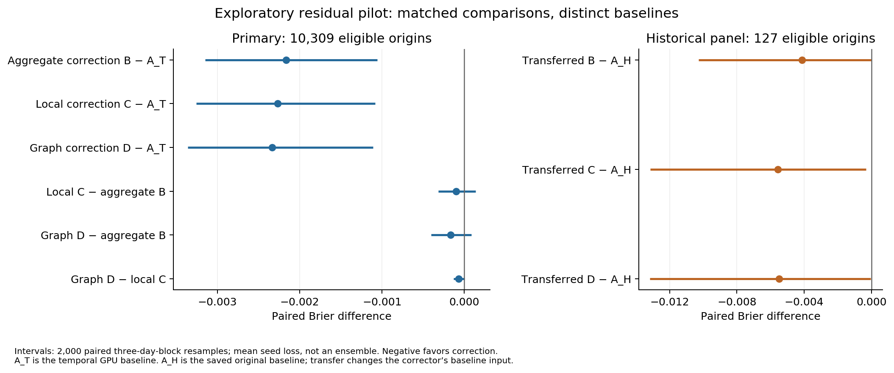
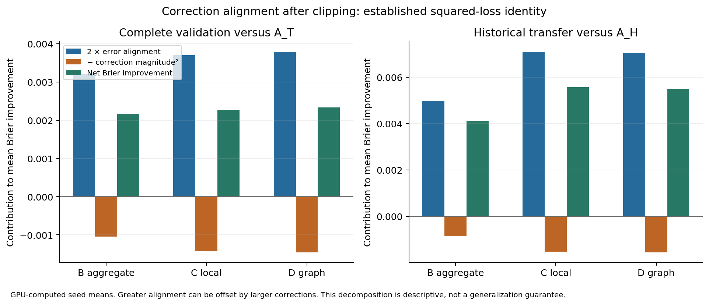

# Residual-correction GPU pilot — 23 September 2026

The authorized pilot completed. **Additional aggregate fitting improved the frozen temporal baseline's exploratory Brier score; useful incremental local-history or graph information remains inconclusive.** Adaptive acquisition did not pass its training-only gate and was not run. This is an experimental continuation after the closeout, not a reversal of the historical simulator, direct-feature or enclosure failures.

The principal limitation is baseline recovery: the original strongest classifier's fitted tree artifact was never saved. The pre-fit protocol therefore used the explicitly allowed, separately named temporal-baseline alternative. The main results below do **not** establish improvement over an honestly trained residual correction of the original strongest model. Exact historical predictions are preserved and used in a separate transfer diagnostic.

**Recommendation:** simplify any next authorized investigation to an aggregate residual-correction replication with a recoverable frozen baseline and an honest chronological calibration path, addressing alarm stability before adding local/graph acquisition. Do not expand this pilot into a full study. Its Brier result justifies examining that limited mechanism, but baseline mismatch, alarm drift, reused validation and unresolved novelty prevent a publishable-method conclusion. No next experiment is launched or authorized by this report.

## Execution and reproducibility

Main began clean at `0f513de6a0691eceed70bdb664b6e7381c8a06ee`; the expected origin was fetched and main integrated without an advance. No applicable AGENTS.md or unrelated changes were found. The plan, Stage 1/2 reports, closeout/reset, provenance, source, prediction tables and ledgers were inspected. Historical scores agree with the request: aggregate 0.02646, direct 15% local 0.03061, direct full local 0.03046, repaired simulator 0.03360; enclosures remained unresolved and added 22–26% runtime. All historical reports/results and executable implementations are preserved. README's current-status introduction is updated.

The [protocol](RESIDUAL_PILOT_PROTOCOL.md) and [configuration](../configs/residual_pilot.json) were committed **before fitting**. All numerical transforms, graph operations, fitting, inference, synthetic checks, scoring and resampling ran on CUDA. CPU work was file parsing/serialization, timestamp metadata, orchestration, hashing, and figure rendering. There is no CPU experimental fallback or benchmark.

| Work | Concrete source SHA | What executed |
|---|---|---|
| Scientific checks, baseline fit, every correction fit, training gate and outer evaluation | `29c64549c12e5daaad187cfe15f774d0ff3cd962` | One frozen baseline, six setting fits and nine selected-seed fits; complete validation and historical transfer |
| Checkpoint replay and transfer-inclusive timing | `637c41b72666113f2e11ec8263ff4e6526f1c5f6` | All nine checkpoints and baseline replayed on GPU; no new fitting/selection |
| Delivery additions | Later delivery commit, reported externally | Rendering, compact CSV transcriptions, metadata audit and documentation; trained executable behavior unchanged |

The [result directory](../results/residual_pilot/pilot01/) contains all attempts, early-stopping histories, selected settings, gate, metrics, predictions, masks, split IDs, timing and run records. Private model checkpoints are retained on the existing Pod and in the ignored local processed-data directory; [checkpoint hashes](../manifests/residual_pilot/checkpoints.json) identify them. They are not distributed in Git. The [README](../README.md) gives reproduction commands; use a new run ID and preserve the cumulative ledger. Checkpoint replay is verified, not a claim that independent optimizer refits on every CUDA version are bitwise identical.

## Frozen baselines and temporal honesty

**A_H_saved** is the unchanged Stage 1/2 aggregate-plus-heterogeneity predictor on its saved 128 origins. Its sklearn HistGradientBoostingClassifier used 100 iterations, 15 leaves, L2=10, learning rate .1, minimum leaf 20 and 255 bins. It had 1,158 features and 2,588 stride-12 training samples. Raw probability is the historical reference; the old calibrated variants remain separate. Source inspection and local/Pod inventories found no fitted trees. The adapter performs an exact origin-indexed GPU lookup and refuses unknown origins. GPU checks agree with both saved Stage 1 and Stage 2 predictions to the declared 1e-12 tolerance. This is not a port of unavailable tree inference.

**A_T_GPUQuantileBoost** is a distinct CUDA implementation, not a silently renamed sklearn fit. It uses the same aggregate feature categories/order and the same tree count/leaf/L2/learning-rate/minimum-leaf choices, but 64 quantile bins and only the first 54 training days. The fitted input free speeds, bin cuts and trees are frozen. The baseline used for correction training is exactly the one used for main evaluation. No correction outcome fitted its corresponding baseline prediction. This is a single honest temporal holdout design, not expanding out-of-fold predictions or a full-training refit.

Existing cached inner predictions were unsuitable: their predictor transforms used the whole outer training period. New transforms use only baseline-fit measurements; correction standardization uses correction-fit inputs only. The **target** retains the original training-defined free speeds/thresholds, fixed for this continuation. Those target constants were originally obtained from the full outer training period; we do not claim they were historically discoverable at the earlier fit cutoff. This separation preserves the same task while preventing later measurements from entering fitted predictor preprocessing.

The original baseline has no complete-validation prediction artifact. The primary workload uses A_T; the old 0.02646 cannot be compared directly to a score over 10,309 origins. On the historical panel, a separately prespecified **transferred correction** feeds A_H to models trained with A_T. This changes the baseline input distribution and is a limited diagnostic. No outer result selected a model, alpha, alarm or seed.

The optional simulator blend was skipped: saved training predictions use full-training preprocessing and a residual-bank procedure with later training information. No additional simulator campaign was launched.

## Task, splits and exposure

The source remains PEMS-BAY recorded speed: 52,116 timestamps × 325 ordered sensors, January–June 2017, five-minute sampling, mph. Naive timestamps have no timezone metadata. The incomplete March 12 day is excluded. History is 12 frames (60 minutes); future is six frames (30 minutes). A positive event means at least **48 sensors** are at or below half their original training reference free speed, sustained over **three consecutive future frames**. This is a regional recorded low-speed event, not a detected incident or causal cascade.

The original complete-day split is 108 training days (January 1–April 19 excluding March 12), 36 validation days (April 20–May 25) and the original 36 test days. Every input/outcome window stays within its split and avoids gaps and the 90-minute embargo on both sides of each boundary. Test values, predictions and event-dependent counts remain unopened. Loading code rejects test measurement requests before reading; its HDF slices are recorded.

| Inner role, all 2017 | Days | Eligible origins / positives | Separated onset groups / event days |
|---|---:|---:|---:|
| Baseline fit: Jan 1–Feb 23 | 54 | 1,294 / 131 sampled at stride 12 | Not estimated from this strided fit sample |
| Correction fit: Feb 24–Mar 16, excluding Mar 12 | 20 | 5,690 / 723; optimizer uses stride 3 | 26 / 15 |
| Settings and early stopping: Mar 17–24 | 8 | 2,251 / 228 | 8 / 6 |
| Shrinkage and alarms: Mar 25–Apr 1 | 8 | 2,251 / 212 | 9 / 5 |
| Refinement gate: Apr 2–19 | 18 | 5,131 / 302 | 14 / 11 |

All inner cuts also use the 90-minute two-sided embargo. Exact days, row spans and origin IDs are in [split_manifest.json](../results/residual_pilot/pilot01/split_manifest.json). The 131 `episodes` reported mechanically for the baseline's one-hour-strided sample are **not independent episodes**; only its 131 positive sampled origins should be used. The complete-role group counts above use at least 30 minutes between event origins and are still not proven independent.

The main workload is **all 10,315 timestamp-eligible validation origins**, fixed before scoring; 10,309 have observed, eligible labels. Six are excluded for future coverage below 95%; none has disagreeing lower/upper event bounds. Missing/nonfinite/nonpositive values are unknown; lower labels count known severe sensors and upper labels allow unknown sensors to be severe. No future value is imputed into an observed label. Historical eligibility, labels and current-active flags match exactly on the old panel.

There are **1,478 positive origins**, prevalence **14.33699%**, grouped into 47 separated groups on 26 event days. Excluding already active or possibly active origins gives **8,981 onset-eligible origins, 289 positives**, with 47 groups on 26 days. The historical panel has 127 eligible origins, 20 positives on 17 event days; its onset subset has 110 origins and five positives on five days. Its 20 represented all-time groups are a sparse-panel statistic, not a census of independent episodes.

**Every one of the 36 validation days had already been exposed** in earlier diagnostics or aggregate event-support summaries. Prior detailed comparisons used the 128-origin panel; this pilot exposes the entire eligible validation trajectory. [The exposure inventory](../results/residual_pilot/pilot01/split_manifest.json) records no untouched validation block. These results are exploratory development evidence. Agreement between seeds does not create independent confirmation. Future confirmation would require a frozen design and separately authorized genuinely unexposed outcomes; the existing test remains closed now.

## Correction mechanism and fair controls

For frozen baseline probability b and available features, the model computes

`r_theta = 0.5 tanh(h_theta); p_alpha = clip(b + alpha r_theta, 0, 1)`.

Training minimizes ordinary empirical Brier loss plus `lambda mean(r_theta²)`, with AdamW weight decay 1e-4. The output head starts at zero; the upstream encoder is randomly initialized. Thus initial predictions and alpha=0 recover b exactly, and the head has a nonzero learning gradient. This construction guarantees baseline recovery, not future risk improvement.

**B** sees the aggregate features and baseline probability only. **C** adds a shared temporal encoder over each sensor's ordered 12-frame state, deviation from block mean, one-step change and mask. **D** uses the same architecture with a normalized neighbor message instead of C's self-message. Both retain identical 16-region masked pooling, so removing messages does not remove regional identity. Missing frames are zeroed before encoding; unobserved sensors cannot send messages. C and D each have **49,553 trainable parameters**; B has **38,209**. B versus C therefore controls extra aggregate fitting but is not an exactly capacity-matched aggregate-only network; C versus D matches trainable capacity and differs in graph operations. The temporal module is a compact shared MLP on ordered histories, not a large temporal architecture.

The graph is the verified distance-similarity adjacency, ordered with the HDF, with self loops removed, identity fallback for 12 isolated rows and row normalization. Row i aggregates neighbors j. Neither directed road flow nor causal propagation is established by these weights. Fixed coordinate-defined regions and shared parameters preserve consistent behavior under simultaneous sensor/graph/block permutation.

Each family had exactly two regularization settings, lambda=.01/.1, tuning seed 20260923. The chosen setting was then fit independently with seeds **20260924, 20260925, 20260926**, identical training procedure, batch 256, learning rate .001, maximum 60 epochs and patience 8. All 15 attempts finished after 11–18 epochs, and every checkpoint/history is retained. Selected lambda: B=.1, C=.01, D=.01. There was no seed selection or probability ensemble. Global alpha was selected from {0,.25,.5,1} using only the shrinkage block: B=(.5,1,.5), C=D=(1,1,1). No outer calibration was fit.

## Comparable predictive results

All main rows below use the same 10,309 eligible all-time origins, binary labels, masks and equal weights. “Mean” is the mean of the three seed-specific losses, not the loss of a mean probability. Paired intervals resample whole days or noncircular three-day blocks 2,000 times on GPU, seed 20260927, retaining overlapping origins and all paired models/seeds together. They condition on the selected architecture/training data and cannot erase prior validation exposure or training uncertainty.

| Model | Seed 20260924 | Seed 20260925 | Seed 20260926 | Mean Brier | Relative reduction vs A_T |
|---|---:|---:|---:|---:|---:|
| A_T frozen | 0.02051931 | same baseline | same baseline | 0.02051931 | — |
| B aggregate correction | 0.01831339 | 0.01776258 | 0.01898119 | **0.01835239** | 10.5604% |
| C local correction | 0.01810574 | 0.01746394 | 0.01918423 | **0.01825131** | 11.0530% |
| D graph correction | 0.01786203 | 0.01757259 | 0.01911663 | **0.01818375** | 11.3822% |

| Paired Brier difference (negative favors added model) | Estimate | 95% day interval | 95% three-day interval |
|---|---:|---:|---:|
| B − A_T | −0.00216692 | [−0.00316832, −0.00125763] | [−0.00314620, −0.00105928] |
| C − A_T | −0.00226800 | [−0.00336951, −0.00125089] | [−0.00325471, −0.00108214] |
| D − A_T | −0.00233555 | [−0.00349996, −0.00127901] | [−0.00336101, −0.00110751] |
| C − B | −0.00010108 | [−0.00034643, +0.00016450] | [−0.00031697, +0.00013773] |
| D − B | −0.00016863 | [−0.00045314, +0.00012544] | [−0.00040587, +0.00008746] |
| D − C | −0.00006755 | [−0.00013430, +0.00000418] | [−0.00013337, +0.00000330] |

All three corrections exceed the provisional 5% Brier point target against A_T. Almost all improvement is already obtained from B. C and D improve over B by only 0.5508% and 0.9189% respectively, with both dependence-aware intervals crossing zero. The graph increment over C is 0.3701%, also uncertain. Thus local and graph claims remain **inconclusive**, not demonstrated absence of information.

On the **separate historical panel**, A_H=0.02645607 and A_T=0.02352209 on identical 127 eligible origins. Transfer means are B=0.02233448, C=0.02088605, D=0.02096492. Three-day difference intervals against A_H are B [−0.01027668,+0.00000467], C [−0.01314015,−0.00031226], D [−0.01316931,−0.00004014]. However, all corresponding one-day intervals include zero; C/D versus B include zero under both choices. Baseline-distribution mismatch, sparse support and interval sensitivity prohibit declaring this successful confirmation against the original baseline. [Historical metrics](../results/residual_pilot/pilot01/historical_panel_metrics.json) retain every seed and onset result.

### Calibration, loss contributions and detection

| Main all-time metric | A_T | B mean | C mean | D mean |
|---|---:|---:|---:|---:|
| Event contribution to Brier | .01233776 | .01115065 | .01114376 | .01123694 |
| Non-event contribution | .00818154 | .00720174 | .00710755 | .00694681 |
| Mean probability; observed prevalence=.14336987 | .13700949 | .13759944 | .13676812 | .13612044 |
| Onset Brier | .01497963 | .01271936 | .01233733 | .01224642 |
| Onset recall | .937716 | .974625 | .967705 | .966551 |
| Onset false-alarm rate | .055798 | **.078501** | .053958 | .051542 |

These are predictive scores after the frozen global shrinkage and clipping, not unbiased simulator probabilities. No separate post-hoc probability calibrator was fit. For diagnostic alpha=1 before selected shrinkage, B's mean all-time Brier is .01791040 and onset Brier .01197161; this later observation does **not** replace its frozen alpha choice. C/D already selected alpha=1. Five-bin reliability tables, zero-probability counts and probability quantiles for every seed/subset are saved. For example, A_T's lowest bin contains 8,654 origins with mean probability .005299 and event rate .009475; its highest bin contains 1,152 with .948776 versus .976563. Clipping creates many exact-zero corrected predictions, and calibration remains imperfect.

Alarms use shrinkage-block onset non-events at the fixed 5% false-alarm target, with a tie-safe threshold. B thresholds are .00688775/.00147442/.00314420. C thresholds are nextafter(0,+inf)/nextafter(0,+inf)/.02876845; D uses the same first two zero-excluding thresholds and .02926656. These tiny thresholds are an intentional exact-zero tie rule, not inferred high precision. There were only 57 positive onset origins in nine groups on five shrinkage event days.

For 289 validation onset positives and 8,692 negatives, exact TP/FP counts are A_T=271/485; B seeds=284/631,277/704,284/712; C=276/318,284/598,279/491; D=276/303,283/563,279/478. B raises mean FPR by about 2.27 percentage points versus A_T, exceeding the protocol's two-point materiality scale. Its Brier gain alone therefore does not establish an adequate deployed alarm system. C/D have no such mean degradation, but seed FPRs vary appreciably. Historical transfer alarms remain A_T-trained rules while A_H has its historical training rule, another explicit transfer limitation.

### Alignment identity

With `delta=p_alpha-b` after clipping and `e=Y-b`, expanding `(e-delta)^2` gives the established identity `mean(e²-(e-delta)²)=2 mean(delta e)-mean(delta²)`. It requires finite square losses and identical origins/weights; it requires no independence assumption as a sample algebra identity. Expected out-of-sample benefit still requires alignment to persist under the future distribution.

| Primary seed mean | Twice alignment | Squared correction magnitude | Net Brier improvement |
|---|---:|---:|---:|
| B | .0032138243 | .0010469035 | .0021669208 |
| C | .0036999525 | .0014319532 | .0022679993 |
| D | .0037925751 | .0014570221 | .0023355531 |

Every individual correction and historical transfer satisfies the identity within 1e-10 in FP64; observed errors are near rounding scale. Local models increase alignment and correction magnitude together, leaving a small uncertain net advantage over B. This is a diagnostic decomposition, not novel theory or causal evidence.

## Why adaptive refinement did not run

The decision was durably saved at **2026-09-23 10:33:43 UTC**, before any new outer measurement loading. On the last 18 training days, mean Brier was A_T=.01713575, B=.01542105, C=.01596071, D=.01586548. D was the predeclared candidate because its gate score was lower than C's. It met the 5% reduction against A_T and detection tolerance, but **did not beat B**. Support was only **14 onset groups on 11 event days**, below the required 20 groups. Both performance and support gates failed.

The region-mask interface and conditional runner are preserved but no acquisition policy was fit, scored or timed. Their unexecuted branches are not validated results. No quality-versus-detail figure or acquisition-saving claim is produced, and none of the reserved 3,600 seconds was used. The contemplated priority was a heuristic using initial summaries, fixed graph metadata and already revealed encodings; no expected Brier-optimality or submodularity derivation is claimed. The established conditional-risk principle would require calibrated conditional errors and costs to justify such a decision rule. Those assumptions were not established here, so the failed empirical gate ends this branch. Old selective-enclosure refinement remains disabled in the default forecasting configuration.

## Complete costs and information accounting

The actual device was **one NVIDIA RTX 6000 Ada Generation**, 50,876,841,984 addressable bytes (49,140 MiB reported by nvidia-smi), driver 570.124.06, CUDA runtime 12.8, PyTorch 2.8.0+cu128, Python 3.12.3. It is neither RTX A6000 nor RTX PRO 6000. NumPy 2.1.2, pandas 2.3.2 and h5py 3.14.0 supported host I/O. The existing Pod environment was reused; no infrastructure or dataset was acquired. Host inspection shows AMD EPYC 75F3, 128 exposed logical CPUs, 540.84 GB host RAM; these are host metadata rather than a guarantee of container entitlement. The workspace had about 79.83 GB free at closure.

| Job, including process startup and all in-job overhead | Conservative GPU-job seconds | CUDA event-span seconds |
|---|---:|---:|
| Numerical audit and warm-up | 5.025060 | 2.696893 |
| Baseline, all 15 correction attempts, gate and saves | 15.996319 | 13.335636 |
| Frozen evaluation, metrics/bootstrap, outputs and timings | 7.076949 | 4.963727 |
| Checkpoint replay and transfer-inclusive cost/profile audit | 13.136527 | 10.368677 |
| **Additional total** | **41.234855** | **31.364933** |

Prior GPU-job usage is **668.623716 seconds**. Reconciled cumulative usage is **709.858571 seconds (about .1972 hours)**. The new pilot used about .01145 hours of its four-hour cap. All four reservations closed with return code zero; there were no failed GPU jobs, retries, compilation or background experiments. The [persistent ledger](../results/residual_pilot/compute_ledger.jsonl) preserves each reservation and process time; the [combined ledger summary](../manifests/residual_pilot/compute_summary.json) reconciles the unchanged historical ledger. Remaining allowance is not an authorization or a target.

CUDA event spans include host launch gaps and are **not active kernel totals**. The numerical-audit profiler recorded .063413 active kernel seconds; a separate complete resident D forward on 128 origins recorded .024368 active kernel seconds. Those partial profiles do not measure total campaign kernel time, which remains unmeasured. Historical Stage 1's 9.30 seconds of rollout CUDA timing has its original narrower scope and is not added as if it were complete active-kernel usage.

Peak allocated VRAM across jobs was **1,649,121,280 bytes**, peak reserved **2,227,175,424**, below the 32 GB ceiling. Training's recorded peak host RSS was 1,776,373,760 bytes; full hardware/run records are preserved. Baseline fitting took 1.18635 internal seconds; each compact correction fit took .317–.841 seconds. The full train job includes feature preparation, all settings/replicates, checkpoint writing and gate inference.

Two timing records distinguish component and complete costs. The original resident-history 128-origin warm-up took .71213 seconds; repeated complete resident-history calls were roughly .174–.194 seconds. Additional fixed-panel warm-up took .68529 seconds. With warm-cache HDF parsing, transfers, transformations, block summaries, baseline, correction and output transfer included, three repeats were:

| Model, seed 20260924 for corrections | Repeat 1 / 2 / 3 complete seconds, 128 origins |
|---|---|
| A_T | .200306 / .186742 / .181961 |
| B | .197644 / .189499 / .180467 |
| C | .188952 / .183058 / .184834 |
| D | .185596 / .190168 / .194088 |

These overlapping timings provide no speedup claim. Most eager time is baseline evaluation and launch overhead. Input parsing cost .017–.021 seconds, H2D .0022–.0056, D2H below .00011 per batch; 3,993,600 input-value bytes and 1,024 probability-output bytes were transferred. Startup/checkpoint loading is excluded from these steady-state calls but included in job totals. The first prepared B forward was cold and is explicitly preserved separately in [inference_timings.json](../results/residual_pilot/pilot01/inference_timings.json); [transfer_costs.json](../results/residual_pilot/pilot01/transfer_costs.json) records every repeat. No CPU comparison was run.

Aggregate features are 1,158 FP64 values = **9,264 bytes/origin**, including regional means, valid counts, heterogeneity and calendar information. Computing them already reads **all 3,900 sensor-history values** (31,200 FP64 bytes) and their validity. Full local access additionally represents 3,900 mask bytes; sending summaries plus full histories/masks would be 44,364 bytes/origin before framing/compression. Sensor identities cost 2,600 int64 bytes once per unchanged ordering; sensor-to-region map another 2,600 and 16 region identities 128 bytes. Fixed graph storage is shared metadata, not free per-session information: the dense FP32 model buffer is 325×325×4=422,500 bytes (FP64 working copy twice that). These are explicit uncompressed representation costs, not a proposed packet format.

C/D derived local inputs occupy 62,400 FP32 bytes/origin plus a 325-byte node mask. Derived channels are computation/memory, not extra independent sensor observations. All data are already stored locally and summaries inspect all sensors; **no physical acquisition, raw storage-I/O or telemetry savings were demonstrated**. Shared graph/identity metadata is not retransmitted for every origin in these accounting examples.

## Checks, limitations and novelty

The CUDA audit passed 11 meaningful check groups: poisoned-mask invariance, exact baseline recovery, head then temporal gradients away from zero, consistent sensor/graph/block permutation, unavailable-region isolation, clipped-loss identity at both boundaries, threshold equality and missing-future labels, alarm ties, identical-model paired resampling, an independently ordered-label boosting example with exact restore, and saved-baseline indexing. Training checks verified nonoverlapping outcome cutoffs. The later replay independently matched all nine saved predictions, labels and masks to 1e-12, checked graph nonnegativity/row sums and regenerated FP64 score summaries. Earlier TP/FP ratios were rounded through FP32 integer division; exact counts are unchanged, and the replay supplement reports FP64 ratios. Two existing metadata/orchestration regressions passed in .63 seconds; historical scientific tests were not misleadingly recounted as new GPU runs.

No scientific assertion failed. A file-transfer attempt using an unsupported SCP directory spelling failed and was retried successfully; an initial local rendering command referred to a nonexistent venv and then used installed Python successfully. Neither launched GPU work or altered scientific results. All attempts that actually fit a model are recorded, including settings that lost selection. Passing tests/replay establishes implementation consistency, not predictive adequacy.

This work preserves the earlier source audit and adds the requested comparisons:

| Primary source and inspected scope | Closest overlap and what this pilot adds |
|---|---|
| Kim et al., [ResCAL](https://arxiv.org/abs/2209.05406), CIKM 2022, [DOI](https://doi.org/10.1145/3511808.3557432); full paper inspected | Add-on traffic residual prediction using previous forecast errors and graph signals already addresses correlated baseline failures, including PEMS-BAY. Its temporal/graph and prototype machinery predicts continuous forecast corrections. This pilot instead tests fixed regional event probability, global shrinkage and aggregate/local/graph controls under temporal holdout. Those experimental differences do not establish methodological novelty. |
| Jin et al., [MURECAST](https://doi.org/10.3390/sym18091485), Symmetry 18(9):1485, 2026; indexed publisher abstract/introduction inspected, full publisher fetch returned HTTP 429 | A frozen traffic-flow baseline, independent residual memory, utility-aligned retrieval and calibrated selective activation overlap directly with honest residual correction and retaining the base when correction is unhelpful. The present learned additive Brier corrector differs in mechanics but has no established stronger result. Exact full-method comparison remains incomplete; inaccessible details are not claimed audited. |
| Ma et al., [EDDI](https://proceedings.mlr.press/v97/ma19c.html), ICML 2019; abstract and PDF acquisition/Partial-VAE sections inspected (scanned PDF pages rendered) | Sequential task-information acquisition and cost-quality tradeoffs are established, with conditional missing-data modeling and expected target information gain. The optional regional heuristic here is neither EDDI's model nor a demonstrated improvement. Since acquisition did not run, there is no new selective-observation finding. |

The [source record](../manifests/residual_pilot/source_audit.json) distinguishes access levels and failures. A graph layer, a risk target, GPU execution and the squared-loss identity do not establish novelty. There is **no established publishable theoretical or algorithmic contribution** from this pilot alone.

Measurement limitations persist from [RESET_NOVELTY_AND_PROVENANCE.md](RESET_NOVELTY_AND_PROVENANCE.md) and [STAGE1_DATA_AUDIT.md](STAGE1_DATA_AUDIT.md). The originating DCRNN release is publicly available and its software has MIT terms; that does not establish measurement analysis/redistribution rights. Exact PeMS processing version, upstream smoothing/imputation and quality flags remain unresolved. No definite restriction identified in the retrieved evidence was bypassed; no account, contact or new dataset was used. Raw HDF and derived input archive hashes match historical manifests. Copying/hashing opaque raw bytes for the authorized Pod did not inspect test measurements. No raw measurements or checkpoints are committed.

| Decision | Status |
|---|---|
| At least 5% Brier point improvement over A_T | Passed by B/C/D; promising exploratory predictive signal |
| Aggregate correction as an operational alarm improvement | Inconclusive: Brier improves, but B's FPR increase exceeds the two-point tolerance |
| Useful local information beyond aggregate correction B | Inconclusive: small point gain; both block intervals cross zero |
| Graph information beyond C | Inconclusive: both block intervals cross zero |
| Conditional acquisition launch | Failed training performance/support gates; no execution |
| Improvement over honestly corrected original strongest baseline | Unresolved: original fitted artifact absent; only transfer diagnostic available |
| Publishable novelty and independent confirmation | Not established |

The narrow defensible finding is a feasible, reproducible additive correction pilot in which aggregate correction captures most observed Brier improvement over an honest but different temporal baseline, while local/graph increments remain uncertain and alarms drift. It neither proves local information valueless nor rehabilitates the simulator/enclosure method. **Test outcomes and predictions remain untouched; selective enclosures remain disabled; no experiment is running.**
